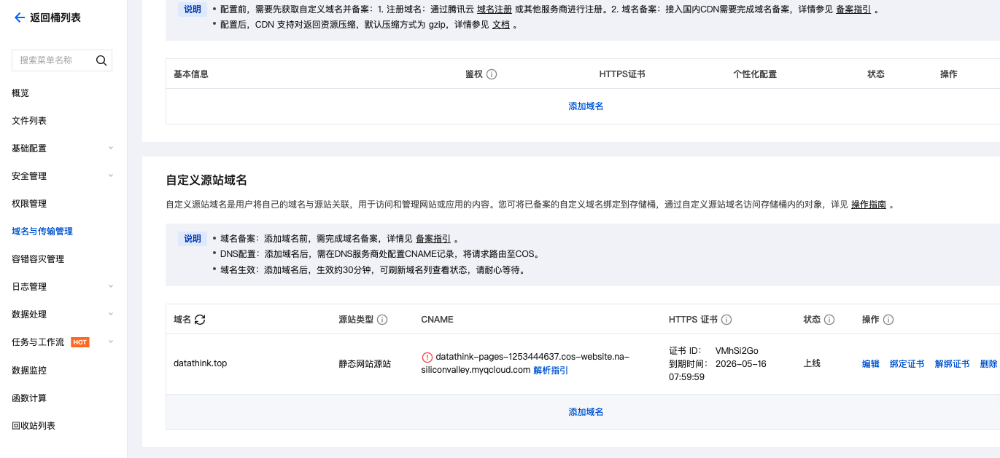
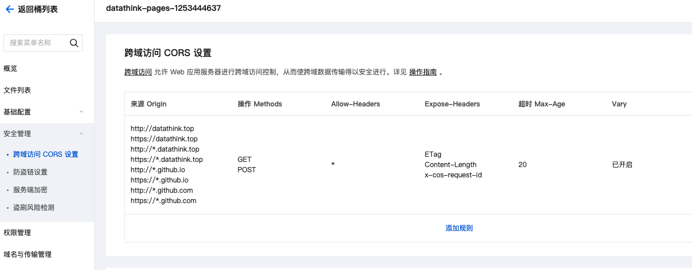
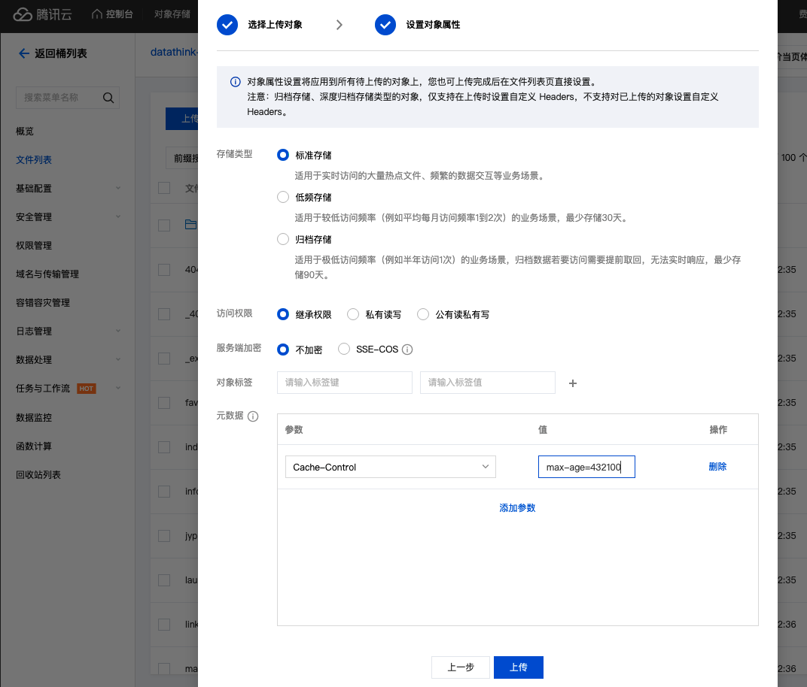
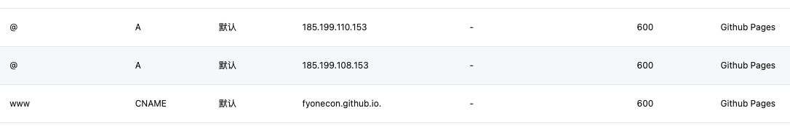
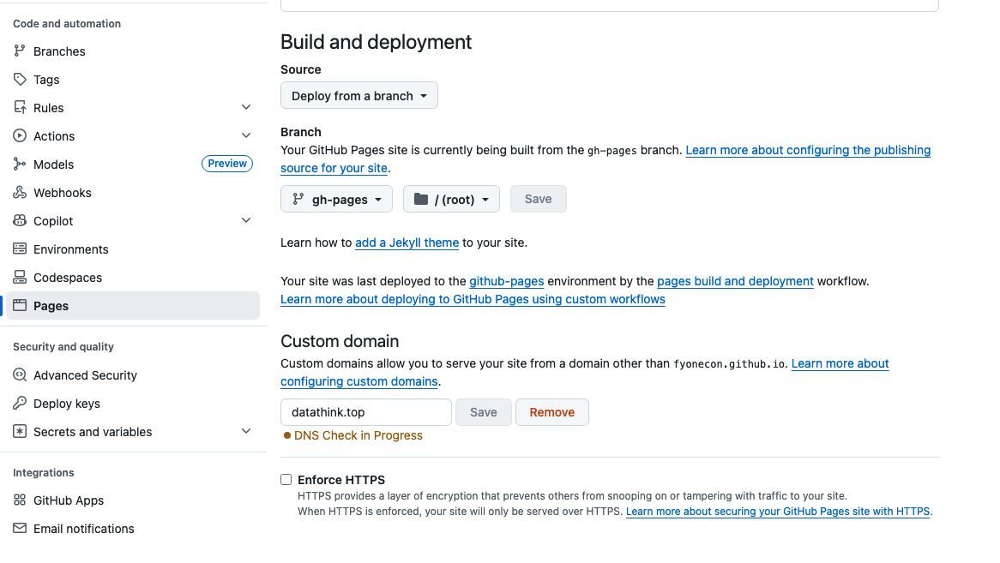

# 1️⃣ViewOnSvelte 开发说明

项目：https://github.com/fyonecon/fyonecon.github.io

最低支持ES2023（iOS16.4+，Android14+，Chrome110+，Firefox115+，Mac OS14+）

### 推荐IDE（webstorm）：
```
https://www.jetbrains.com/webstorm/download/?section=mac
```
### 部署Github或CDN静态网站：
```
项目可以上传到Github+自动部署：
使用 /.github/workflows/deploy.yml 配置文件；
还需要在 Github仓库-设置-pages 里面指定分支。

CDN静态网站文件生命周期：
html、file、json：max-age=4321
css、js: max-age=432100 或 max-age=4321000

```

===================================

# 2️⃣Svelte静态网站配置与部署

### 常用命令：
在/frontend/view/目录运行：
```
npx sv create svelte
```

更改端口为9770（本地开发环境用）:
```
在vite.config.js中设置：

server: {
    port: 9770, // 固定端口为 9770
    strictPort: true, // 如果端口被占用，不自动选择其他端口
    host: true // 允许外部访问（可选）
}
```

项目所在文件夹：/frontend/view/svelte/
```
npm install

npm run dev

npm run build

npm run preview

```

### Svelte打包静态网站：
静态网站请参考：
https://svelte.dev/docs/kit/adapters
```
npm i -D @sveltejs/adapter-static
```
在/frontend/view/svelte/svelte.config.js添加如下内容:
```
//import adapter from '@sveltejs/adapter-auto';
import adapter from '@sveltejs/adapter-static';

/** @type {import('@sveltejs/kit').Config} */
const config = {
	kit: {
		// adapter-auto only supports some environments, see https://svelte.dev/docs/kit/adapter-auto for a list.
		// If your environment is not supported, or you settled on a specific environment, switch out the adapter.
		// See https://svelte.dev/docs/kit/adapters for more information about adapters.
		adapter: adapter({
			// default options are shown. On some platforms
			// these options are set automatically — see below
			pages: './dist',
			assets: './dist',
			fallback: '404.html',
			precompress: false,
			strict: true
		}),
		// 添加路径重写配置
        paths: {
            base: '', // 根据你的部署路径设置
            assets: '' // 根据你的部署路径设置。CDN如：'http://127.0.0.1:9750/view/svelte/dist'，，结尾无/
        },
	}
};

export default config;
```
### 将 ./dist/ 文件全部放在你的CDN里面或服务器里面即可。

比如部署在CDN：

绑定域名，域名解析指向CNAME ：


安全配置，设置CORS和Refer ：


配置缓存，max-age=432100 ：



===================================

# 3️⃣Github部署：

### Github Pages CI/CD：
配置CI/CD：./.github/workflows/deploy.yml

### Github Pages 自定义域名：
如下图，将@记录添加IPv4，将www添加对应的CANME。
https证书 Github Pages会自动颁发（90天 Let's Encrypt），域名解析端不需要配置。

域名解析端：


Github Pages端（settings/pages）



===================================
# 2026-02-02